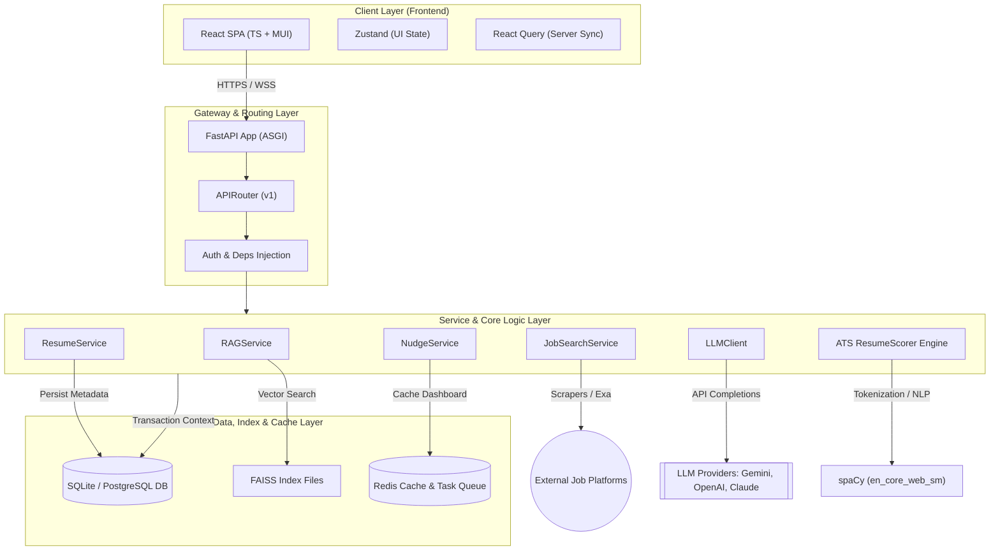
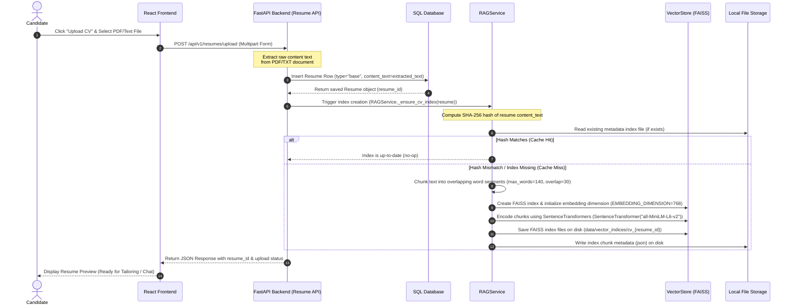
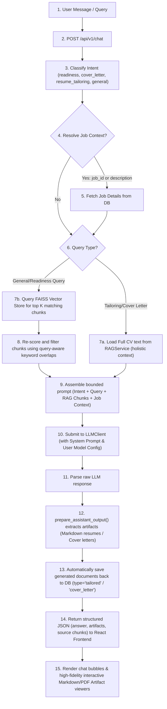
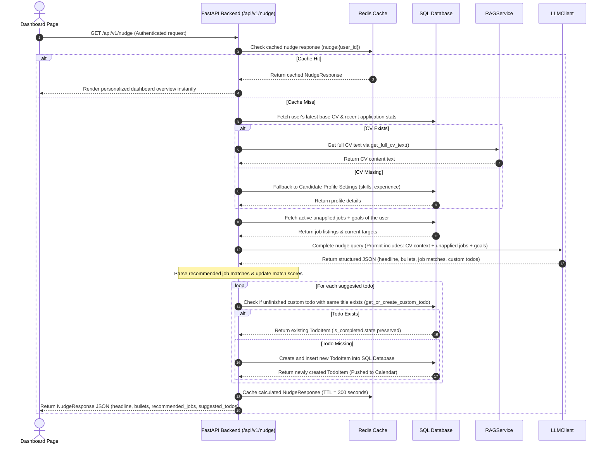

#  Architecture of CareerPilot
### `By IUT_shonghorsho`

Welcome to the architectural design document for **CareerPilot** (built by `IUT_shonghorsho`). This document maps out the system components, engineering patterns, and the exact end-to-end data flows from **CV upload and indexing** to **context-grounded AI agent responses**.

---

## 1. High-Level System Architecture

CareerPilot is structured as a decoupled, asynchronous, high-fidelity AI-assisted career companion. It features a React-based Single Page Application (SPA) on the frontend and an async-first FastAPI service on the backend.

---

## 2. Phase A: Resume Upload & Vector Indexing Flow

When a candidate uploads their primary (or a tailored) CV, the system extracts the raw text and generates a localized vector store index using FAISS. This makes the resume searchable and retrieval-friendly for subsequent RAG workflows.

---

## 3. Phase B: AI Chat & Context-Grounded Retrieval Flow

When a user interacts with the career assistant (e.g., asking "Am I ready for this job?" or "Tailor my CV for this role"), the system dynamically determines their intent, retrieves RAG chunks, constructs a bounded context, queries the LLM, and parses output into high-fidelity markdown artifacts.

---

## 4. Phase C: Dashboard Personalized AI Nudge Flow

The Dashboard utilizes the same RAG architecture to personalize metrics, advice, job recommendations, and calendar to-dos dynamically.

---

## 5. Architectural Design Principles

1. **Async-First Execution**:
   - All I/O operations—database transactions (SQLAlchemy 2.0 with `AsyncSession`), Redis caching, vector indexing, and LLM completions—are fully asynchronous (`async`/`await`), maximizing hardware utilization and concurrent request handling.
   
2. **Deterministic Context Boundaries**:
   - Instead of injecting massive documents into the LLM context (which increases token consumption and latency), the `RAGService` limits the context size using semantic text splitting, keyword boosts, and localized query-aware filtering.

3. **Separation of Concerns**:
   - The **Business Logic Layer** (`services/`) is fully separated from **API presentation routers** (`api/v1/`) and **Core Domain modules** (`core/`). This ensures components like the `LLMClient` or `VectorStore` can be unit tested in isolation without spawning mock web servers.

4. **Robust Fallbacks & Self-Correction**:
   - If Redis is unavailable, the backend falls back seamlessly to direct database computation.
   - If spaCy models or FAISS indices fail to initialize, lexical token searches (`rag_fallbacks.py`) provide instant backup.
   - If the user's CV is completely missing, the platform automatically pivots to onboarding configurations, helping them register their profile without crashing the dashboard.o