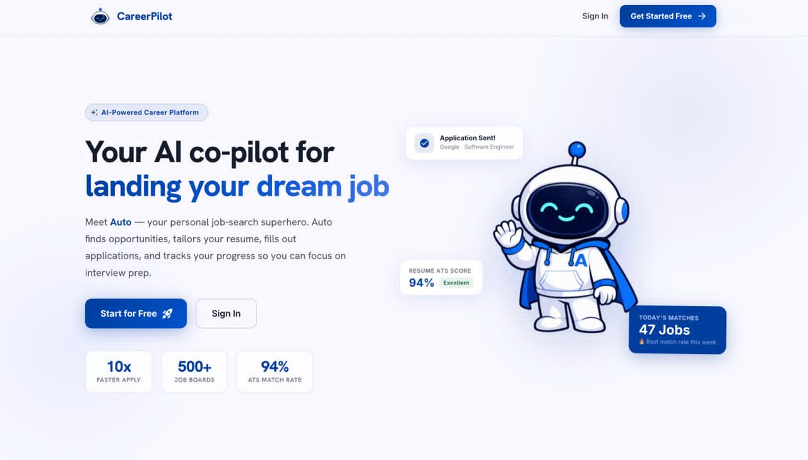
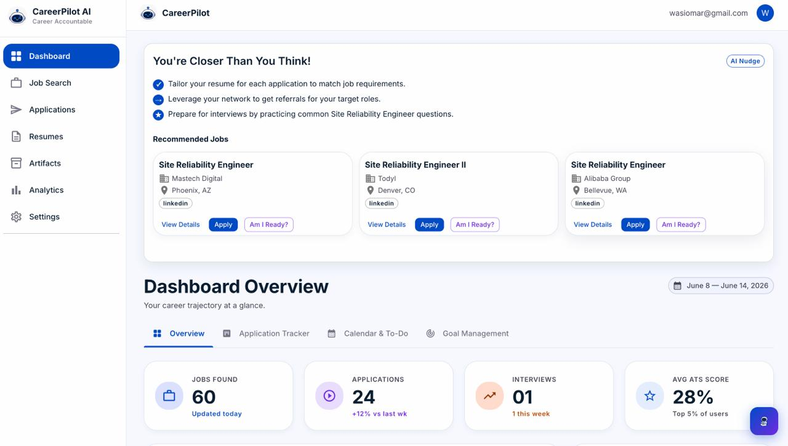
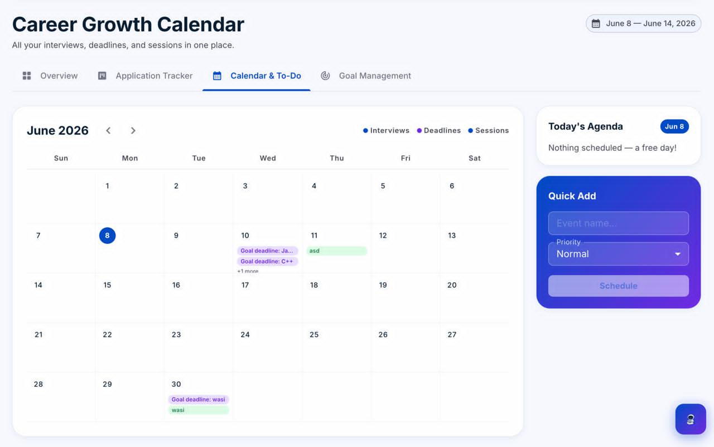
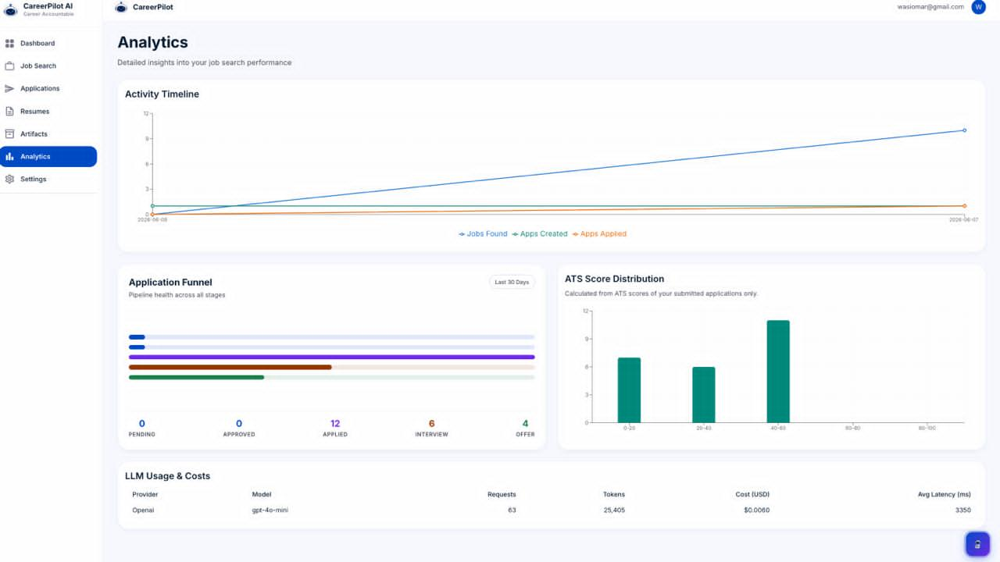
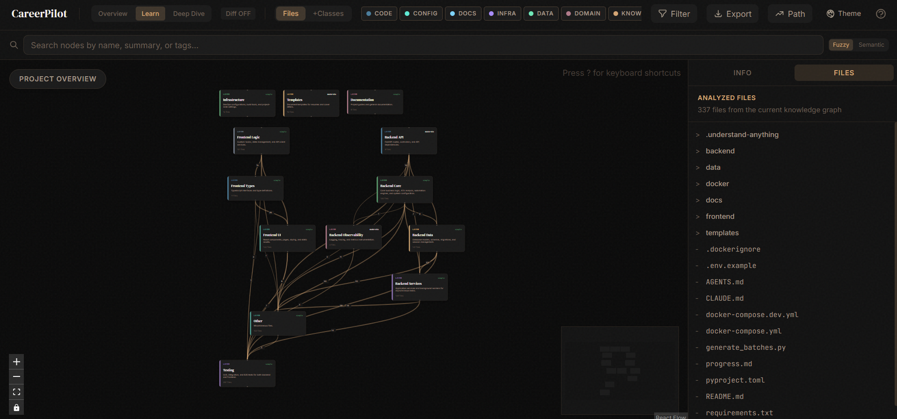

#  CareerPilot
### `By IUT_shonghorsho`

CareerPilot is an interactive, RAG-grounded personal career assistant that personalizes your job applications, tracks your career transition metrics, suggests actionable checklist items, and generates publication-grade tailored CVs and cover letters.

---

## ✨ Visual Showcase & Interface Gallery

Experience the premium, state-of-the-art interface of CareerPilot built for seamless career transitions:

| **Platform Landing Page** | **AI-Personalized Dashboard** |
|:---:|:---:|
|  |  |

| **Interactive Job Search & Scraping** | **Application Tracking Kanban** |
|:---:|:---:|
|  |  |

| **Actionable To-Do Calendar** | **Roadmap & Personal Career Goals** |
|:---:|:---:|
|  |  |

| **Dynamic Application Analytics** | **Knowledge Graph Codebase Topology** |
|:---:|:---:|
|  |  |

---


## 🚀 Quick Start Guide

### 1. Clone & Prerequisite Checklist
Clone the repository to your local machine:
```bash
git clone https://github.com/Sk-Muhaiminul-Hasan/CareerPilot_IUT_Shonghorsho
cd CareerPilot_IUT_Shonghorsho
```

* **Python**: Version 3.11.x installed.
* **Node.js**: Version 18.x or 20.x installed.
* **Database**: PostgreSQL (with PGVector enabled) or SQLite local file.
* **Cache/Queue**: Redis instance (local or serverless like Upstash).

---

### 2. Environment Configuration
Before launching, copy the template `.env.example` file to `.env` in the **project root** to configure database connections, Redis URLs, and LLM API credentials.

```bash
# Copy the env file from root
cp .env.example .env
```

Open `.env` and fill out at least one LLM Provider key (Gemini is highly recommended for high performance and low unit-costs):
```ini
# --- Database ---
DATABASE_URL=postgresql+asyncpg://neondb_owner...
DATABASE_URL_SYNC=postgresql+psycopg2://neondb_owner...
REDIS_URL=rediss://default:...

# --- LLM Providers ---
LLM__GEMINI_API_KEY=your_gemini_api_key_here
LLM__PREFERRED_PROVIDER=gemini
```

---

### 3. Backend Setup & Run (Optimized)

Follow these streamlined, consolidated steps to create your virtual environment and launch the FastAPI server:

```powershell
# 1. Navigate to the backend directory
cd backend

# 2. Create the Python 3.11 virtual environment inside 'backend'
py -3.11 -m venv venv311

# 3. Activate the virtual environment
.\venv311\Scripts\activate

# 4. Install backend dependencies and developer tools in editable mode
pip install -e ".[dev]"

# 5. Download spaCy's English core model (required for ATS scoring & keyword analysis)
python -m spacy download en_core_web_sm

# 6. Install Playwright browser binaries (for platform scraping & automation)
playwright install chromium

# 7. Start the FastAPI application server
python run.py
```

> [!TIP]
> **Why this order is optimized**: By executing `cd backend` first, `venv311` virtual environment folder is created cleanly inside the backend directory, preventing clutter in root repository and ensuring smooth relative paths for activation.

---

### 4. Frontend Setup & Run

Launch the React + TypeScript development server with hot-reloading:

```bash
# 1. Navigate to the frontend directory
cd frontend

# 2. Install required npm packages
npm install

# 3. Start the Vite React development server
npm run dev
```

The frontend will run at `http://localhost:5173` (or `http://localhost:3000` depending on port availability), and communicate automatically with your backend FastAPI service running at `http://localhost:8000`.

---

## 🛠️ Docker Compose Alternative

For containerized running of all backend services, database migrations, and frontend UI in developer hot-reload mode:

```bash
# Build and run the entire stack (FastAPI + React + Redis)
docker compose -f docker-compose.yml -f docker-compose.dev.yml up --build
```

---

## 📁 Repository Map

* [backend/](backend/) — FastAPI backend codebase.
  * [app/api/v1/](backend/app/api/v1/) — REST routes (nudge, chat, jobs, goals).
  * [app/core/](backend/app/core/) — Domain logic (ATS scoring, LLM clients, automation scrapers, vector stores).
  * [app/services/](backend/app/services/) — Core business services (chat context, RAG orchestration, nudge calculations).
* [frontend/](frontend/) — React SPA source code.
  * [src/components/](frontend/src/components/) — Custom UI layouts, dashboards, and job cards.
  * [src/hooks/](frontend/src/hooks/) — React Query state hook layers.
* [ARCHITECTURE.md](ARCHITECTURE.md) — Comprehensive technical maps and RAG data flow charts.
* [SYSTEM_DESIGN.md](SYSTEM_DESIGN.md) — High-volume scaling bottlenecks (10k users) and cost audits.
