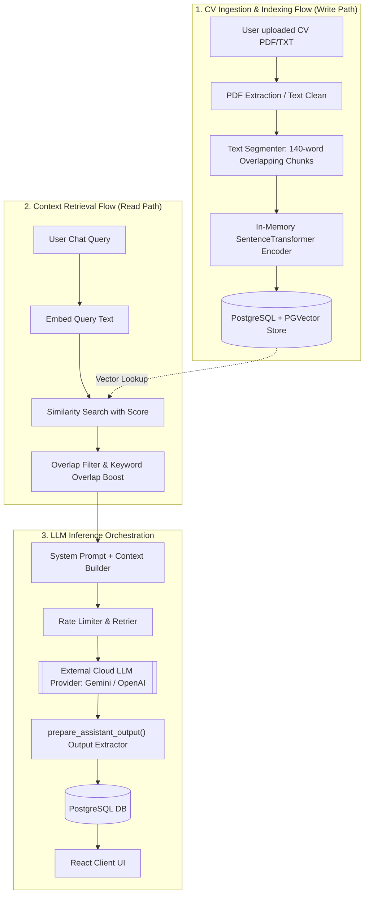
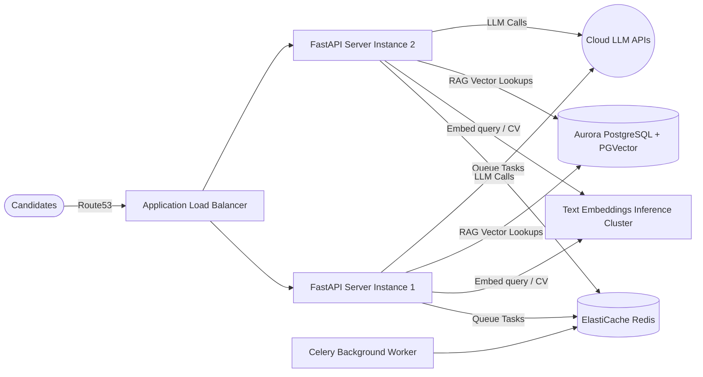

#  System Design of CareerPilot
### `By IUT_shonghorsho`

This document details the system design, scalability roadmap, and cost-benefit analysis of **CareerPilot**. 

---

## 1. Production-Grade Data Flow Architecture

The data lifecycle within CareerPilot can be visualized in three distinct execution phases: **Ingestion & Embedding**, **Semantic Retrieval (RAG)**, and **Inference Orchestration**.

---

## 2. Scaling CareerPilot to 10,000 Monthly Active Users (MAUs)

Scaling an application featuring local embedding encoders and high-frequency LLM requests requires transition from single-node deployments to distributed systems.

### 2.1 Concurrency & Traffic Modeling
Assuming **10,000 Monthly Active Users (MAUs)**:
* **Daily Active Users (DAUs)**: Typically ~10% of MAUs = **1,000 DAUs**.
* **Peak Concurrent Users (PCUs)**: Assuming a peak-to-average ratio of 10 during active hours (e.g. evening hours), we expect **100 concurrent active users**.
* **Traffic Rates**:
  * **Chat Interactivity**: An active user in a session sends 1 query every 30 seconds = 3.3 QPS total query load.
  * **Dashboard Loads**: Active users refreshing dashboards to fetch nudges (1 request every 5 minutes per user) = 0.33 QPS.
  * **Aggregate Peak Load**: **~5.0 Queries Per Second (QPS)** across the API.

---

### 2.2 Sizing the Infrastructure

To support peak load while maintaining sub-second API latencies (excluding LLM generation time):

| Component | Sandbox Spec (Current) | Production Spec (10k Users) | Purpose |
| :--- | :--- | :--- | :--- |
| **API Application Nodes** | 1x Local Docker Container | 2x AWS `c6g.large` (2 vCPUs, 4GB RAM) behind an ALBA | Scale out FastAPI ASGI workers, run uvicorn with Gunicorn |
| **Database Instance** | SQLite Local File | AWS Aurora PostgreSQL (`db.t4g.medium` or Neon equivalent) | Provide persistent relational storage & high-concurrency pools |
| **Vector Index Storage** | FAISS File Cache | PGVector Extension inside the Aurora DB Instance | Unified querying, transaction isolation, and DB-backed embeddings |
| **Inference/Embedding Engine** | Thread Pool inside API Workers | HuggingFace TEI (Text Embeddings Inference) Container on ECS | Offload SentenceTransformers CPU load from FastAPI workers |
| **Caching & Job Queue** | Local memory/No-op Redis | AWS ElastiCache for Redis Server (`cache.t4g.micro`) | Manage asynchronous queue processing & dashboard caching |

---

## 3. Key Performance Bottlenecks & Strategic Mitigations

Scaling from 1 to 10,000 users exposes clear architectural bottlenecks. Below are the key vulnerabilities identified in the current codebase and their strategic production mitigations:

### Bottleneck 1: CPU Starvation via Local SentenceTransformer Embedding Loading
* **Code Vulnerability**: In `backend/app/core/matching/vector_store.py` line 43, `SentenceTransformer("all-MiniLM-L6-v2")` is loaded lazily inside the API container and executed using standard CPU threads (`loop.run_in_executor`).
* **The Scale Problem**: Standard sentence embedding on CPUs takes **15ms - 50ms per query**, and upwards of **500ms** to chunk and embed a multi-page resume. Under a peak load of 5 QPS, API CPU utilization will spike to 100%, causing request queueing, packet drops, and severe latency degradations.
* **Mitigation**: 
  1. **Deploy Dedicated Inference Server**: Move sentence embedding processing out of API workers to a dedicated **Hugging Face Text Embeddings Inference (TEI)** cluster running on AWS ECS. TEI is built in Rust, features dynamic batching, and yields sub-10ms latencies on CPU and sub-2ms on GPU.
  2. **Cloud Embedding Fallback**: Migrate to cloud-based embedding endpoints (e.g., `text-embedding-3-small` or Gemini Embedding API) which costs pennies and scales out automatically.

### Bottleneck 2: Raw Connection Pools Bypass by PGVector Store
* **Code Vulnerability**: Inside `vector_store.py` lines 88 and 117, Langchain’s synchronous `PGVector` client is instantiated directly on each request, creating a raw connection string via `clean_sync_database_url`.
* **The Scale Problem**: Every chat session, resume analysis, and dashboard nudge will instantiate a raw, synchronous TCP database connection to PostgreSQL outside of the FastAPI/SQLAlchemy `AsyncSession` pool. Under concurrency, database connection limits (usually 100-200 on medium database tiers) will immediately exhaust, resulting in `ConnectionRefusedError: too many clients already`.
* **Mitigation**: 
  - Rewrite `VectorStore.add_items` and `VectorStore.search` to use **SQLAlchemy Async Session connection pools** directly. Since PGVector is fully supported natively by SQLAlchemy (`pgvector.sqlalchemy`), this leverages SQLAlchemy's optimized connection pooling, keeps connections async-first, and caps concurrent connections safely.

### Bottleneck 3: Synchronous spaCy NLP Extraction Blockers
* **Code Vulnerability**: `KeywordAnalyzer`, `SkillMatcher`, and `ExperienceAnalyzer` load spaCy's `"en_core_web_sm"` and execute synchronous parsing (`nlp(text)`) inside FastAPI request contexts.
* **The Scale Problem**: spaCy document parsing is a synchronous, CPU-intensive operation. Running this on large resumes during background match evaluations will block Python's single-threaded event loop, stalling all other concurrent async tasks in that worker.
* **Mitigation**: 
  - Offload heavy resume parsing, ATS scoring, and platform scraping requests to **async Celery/arq workers** backed by Redis. Use FastAPI solely to register the request, yield a task ID immediately to the client, and let the frontend poll/web-socket subscribe for completion.

---

## 4. Cost-Benefit & Unit Economics Analysis

Below is the monthly cost estimation for running CareerPilot at **10,000 MAUs** (with a healthy, interactive workload).

### 4.1 Usage Assumptions (Per User/Month)
* **Chat Sessions**: 12 chat interactions per month.
  * Average prompt: **5,000 tokens** (includes RAG context, system instructions, and job description).
  * Average output: **800 tokens** (tailored sections, cover letters, or career guidelines).
* **Dashboard Nudges**: 15 requests per month (updated every ~2 days).
  * Average prompt: **6,000 tokens** (includes full CV + active goals + up to 10 available job summaries).
  * Average output: **400 tokens** (JSON holding headline, bullets, matched job scores, and custom todos).
* **Resume Generation/Tailoring**: 2 operations per month.
  * Average prompt: **12,000 tokens** (full CV context, extensive target job posting).
  * Average output: **1,500 tokens** (clean, comprehensive publication-grade markdown resume).

---

### 4.2 LLM Api Cost Matrix (Gemini 1.5 Flash)
Gemini 1.5 Flash is highly optimal for this volume due to its deep context window, high accuracy, and industry-leading unit economics.
* **Input Token Cost**: **$0.075 / 1,000,000 tokens**
* **Output Token Cost**: **$0.30 / 1,000,000 tokens**

#### Monthly Token Consumption Calculation per User:
$$\text{Input Tokens} = (12 \times 5,000) + (15 \times 6,000) + (2 \times 12,000) = 174,000 \text{ tokens}$$
$$\text{Output Tokens} = (12 \times 800) + (15 \times 400) + (2 \times 1,500) = 18,600 \text{ tokens}$$

#### Monthly LLM Cost per User:
$$\text{Input Cost} = 174,000 \times \left(\frac{\$0.075}{1,000,000}\right) = \$0.01305$$
$$\text{Output Cost} = 18,600 \times \left(\frac{\$0.30}{1,000,000}\right) = \$0.00558$$
$$\mathbf{\text{Total LLM Cost / User / Month}} = \$0.01305 + \$0.00558 = \mathbf{\$0.01863} \approx \mathbf{1.9 \text{ cents}}$$

---

### 4.3 Full Scale Monthly Budget (10,000 Users)

| Category | Item Spec | Provider | Cost / Month | Cost / User |
| :--- | :--- | :--- | :--- | :--- |
| **Compute Node** | 2x `c6g.large` ECS API Servers | AWS Fargate | $72.00 | $0.0072 |
| **Relational Database** | Serverless PostgreSQL (with PGVector) | Neon / AWS Aurora | $90.00 | $0.0090 |
| **Redis Cache** | Serverless Redis Tier (1GB Active Storage) | Upstash / AWS | $20.00 | $0.0020 |
| **Embedding Engine** | Hugging Face TEI Cluster | AWS Fargate | $36.00 | $0.0036 |
| **LLM Core API** | Gemini 1.5 Flash (1.92B Input / 186M Output) | Google Cloud | $186.30 | $0.0186 |
| **System Logging** | Structured Log Aggregator & Trace Tracker | Datadog / Grafana | $40.00 | $0.0040 |
| **Total** | | | **$444.30** | **$0.0444** |

### Unit Economics Summary:
At scale, running CareerPilot costs **$0.044 per user/month** (under 5 cents). 

With a premium subscription pricing tier of just **$5.00/month**, the gross profit margin stands at **99.1%**, indicating an exceptionally scalable, cost-efficient, and sustainable business model.