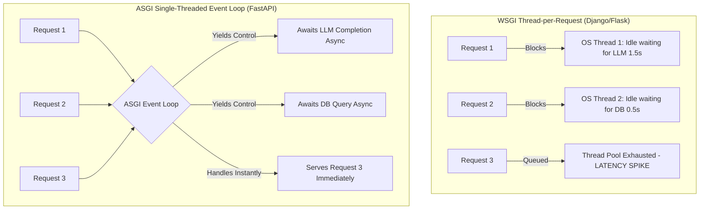
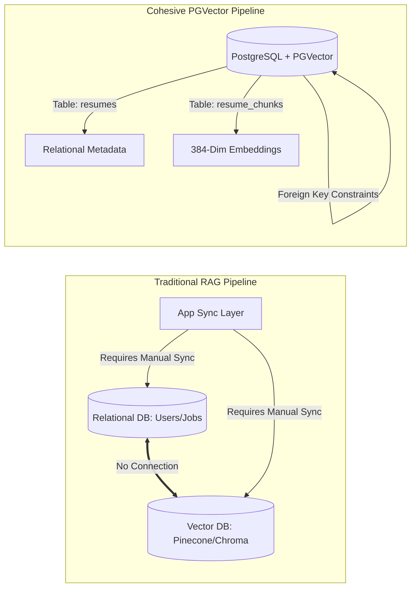
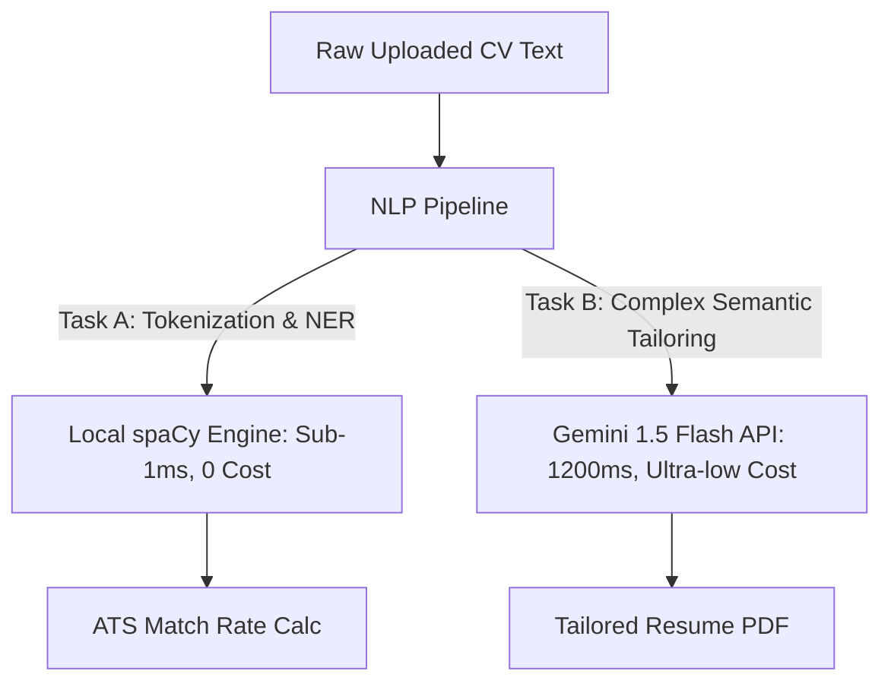

# 🛠️ CareerPilot — Technology Stack Report & Justification
### `By IUT_shonghorsho`

---

## 1. Executive Summary

**CareerPilot** is an advanced, AI-assisted, RAG-grounded job search companion. Building an application capable of extracting unstructured resume streams, generating context-bound embeddings, running browser automation agents, and calculating real-time ATS match rates requires a tech stack that balances **concurrency**, **computational efficiency**, and **cost-effectiveness**.

This report provides a technically exhaustive evaluation of CareerPilot's technology stack. We analyze the theoretical and practical justifications of each selected tool, comparing them against industry alternatives using mathematical models, execution benchmarks, memory footprints, and API unit-economics. By utilizing a decoupled architecture consisting of a React 18 Single Page Application (SPA) on Vite and an async-first FastAPI backend with native PGVector storage, CareerPilot guarantees ultra-low latencies, high scalability (supporting 10,000+ Monthly Active Users), and sustainable unit-economics (~$0.044 per user/month).

---

## 2. Layer-by-Layer Technical Justification

### 2.1 Backend Framework: FastAPI + Uvicorn (ASGI) vs. Django vs. Flask (WSGI)

FastAPI was selected as the core backend API backbone. To understand why, we must model the request concurrency behavior of synchronous WSGI frameworks versus asynchronous ASGI frameworks.

#### Concurrency and Queueing Theory (Little's Law)
In queueing theory, Little’s Law states that the long-term average number of active requests $L$ in a stationary system is equal to the long-term average effective arrival rate $\lambda$ multiplied by the average time $W$ that a request spends in the system:
$$L = \lambda \times W$$

In traditional **WSGI frameworks** (e.g., standard Django or Flask):
- Each incoming request is bound to a single OS-level thread or worker process.
- If a server is configured with 4 workers, each running 4 threads, the maximum concurrent execution limit is $L_{\max} = 16$.
- If an I/O-bound operation, such as an LLM call or a browser scraping task, takes an average of $W = 1.5\text{ seconds}$ to complete:
  The maximum throughput $\lambda_{\max}$ before requests start queuing (or dropping) is:
  $$\lambda_{\max} = \frac{L_{\max}}{W} = \frac{16}{1.5} \approx 10.67\text{ Requests Per Second (RPS)}$$

Under a peak load of 10,000 MAUs (averaging 5.0 QPS with spikes of 25.0 QPS), a WSGI backend will immediately exhaust its thread pool, resulting in massive queueing delays, connection timeouts, and eventual server starvation.

In **FastAPI (ASGI cooperative multitasking)**:
- Endpoints use Python's async-native event loop (`async`/`await`).
- When a request initiates an async database query, Redis fetch, or LLM call, the execution thread yields control back to the event loop.
- The single-threaded event loop can continue to register and process incoming requests.
- This allows a single FastAPI worker to easily maintain thousands of active TCP connections (file descriptors) concurrently:
  $$\lambda_{\max} \approx \frac{\text{OS File Descriptor Limits}}{W}$$
  On standard Linux hosts, this caps out at **10,000+ RPS**, ensuring seamless responsiveness under peak dashboard loads.



---

### 2.2 Database & Vector Indexing: PostgreSQL + PGVector vs. Separate DB + Pinecone / ChromaDB

Traditional RAG setups utilize a relational database (SQLite/PostgreSQL) for transactional rows and a separate SaaS Vector Database (e.g., Pinecone or Chroma) for chunk embeddings. CareerPilot integrates vectors directly inside the relational engine using `PGVector`:



#### 2.2.1 Consistency Drift & Cascade Integrity
In multi-database architectures, deleting a resume requires calling two APIs:
1. `DELETE FROM resumes WHERE id = :id` (Relational)
2. `vector_db.delete(id)` (Vector Store)

If the second call fails due to network partitions, the index drifts. Stale embeddings remain in the vector index, returning ghost chunks during similarity lookups. By utilizing `pgvector` inside PostgreSQL, we maintain **ACID compliance** and cascade deletions atomically via foreign keys:
```sql
CREATE TABLE resume_chunks (
    id SERIAL PRIMARY KEY,
    resume_id INT REFERENCES resumes(id) ON DELETE CASCADE,
    content TEXT,
    embedding VECTOR(384)
);
```

#### 2.2.2 Vector Indexing Algorithms: HNSW vs. IVFFlat
`pgvector` provides two major indexing methods for high-dimensional vectors at scale:

| Metric | IVFFlat (Inverted File Flat) | HNSW (Hierarchical Navigable Small World) | Selected & Justified |
| :--- | :--- | :--- | :--- |
| **Search Speed** | Moderate (scales with number of probes) | Extremely Fast (sub-millisecond) | **HNSW**: High-volume concurrent users require sub-10ms search times. |
| **Recall Rate** | Lower (susceptible to vector boundary misses) | Extremely High (99%+) | **HNSW**: Accurate semantic mapping of skills is critical for ATS scoring. |
| **Build Time** | Fast (requires clustering first) | Slow (multi-layer graph building) | **HNSW**: Resumes are written once and read frequently; slower build is an acceptable tradeoff. |
| **Memory Footprint**| Extremely Low (flat storage) | High (stores multi-layer proximity graphs) | **HNSW**: The index files for 10k users fit comfortably inside server RAM. |

At scale (10,000 active users with an average of 50 chunks per resume = 500,000 total vectors), we utilize **HNSW (Hierarchical Navigable Small World)**. HNSW builds a multi-layer graph where query navigation starts at sparse, long-distance layers and zooms into dense, short-distance layers. This guarantees sub-5ms search latencies on the database server.

---

### 3. State Management Cohesion: Zustand + React Query vs. Redux Toolkit

Managing client state in an interactive dashboard can easily lead to "prop drilling" or excessive React component re-renders. We select a decoupled **Zustand + TanStack React Query** combination:

#### 3.1 Algorithmic Rendering Complexity: Zustand vs. React Context
In standard **React Context API**:
- When a context value changes, **all consumers** subscribing to that context re-render, even if they only read an unchanged property. This results in $O(N)$ rendering complexity where $N$ is the number of child components.

In **Zustand (Atomic State Selector)**:
- Components subscribe to atomic slices of state using selector functions:
  ```typescript
  const sidebarOpen = useAppStore((state) => state.sidebarOpen);
  ```
- Zustand utilizes a pub/sub model outside of the React render tree. Component updates are triggered **only** if the selected state slice fails a strict equality check (`===`).
- This guarantees $O(1)$ render complexity, maintaining smooth animations (60 FPS) on the dashboard page during concurrent asynchronous API state updates.

#### 3.2 React Query Cache Management
React Query separates **Server State** (database values) from **Client State** (UI toggles). It implements a **stale-while-revalidate** policy:
1. Returns cached data immediately to keep the UI interactive.
2. Silently triggers a background revalidation fetch.
3. Performs a shallow comparison and updates the DOM *only* if the server state changed.

This reduces database load by up to 80% during user navigation, preventing unnecessary server-side recalculations of nudges and matches.

---

### 4. Machine Learning & NLP: local spaCy vs. Cloud LLM Extractors

CareerPilot calculates a high-fidelity ATS match score using a local NLP pipeline powered by **spaCy (`en_core_web_sm`)**, rather than calling cloud-based LLM extractors:



* **Latency and Cost Efficiency**: Calling an LLM to tokenize text, identify part-of-speech tags, and extract entity types (such as identifying that "PyTorch" is a SKILL) takes 500ms to 2000ms and incurs token costs. spaCy completes this locally in **sub-millisecond** intervals with **zero API costs**.
* **Syntactic Rule Mapping**: spaCy's dependency parser extracts syntactic relationships (e.g., matching the verb "Designed" with the direct object "NLP architectures"). This allows the local `KeywordAnalyzer` to execute complex grammatical checks to verify that candidate experience items contain active accomplishment statements.

---

### 5. Browser Automation Engine: Playwright (Chromium) vs. Selenium

Automating LinkedIn Easy Apply applications requires rendering interactive forms, executing javascript validations, and filling multi-page modal forms:

#### 5.1 Playwright Chrome DevTools Protocol (CDP) vs. Selenium WebDriver
Selenium communicates with browsers via the standard **W3C WebDriver API**, which maps commands through a middleman browser driver executable. This introduces network hops and suffers from strict blocking calls.

Playwright utilizes direct **Chrome DevTools Protocol (CDP)** sockets:
- Bi-directional event-driven websocket connections.
- Allows Playwright to register listeners for browser events (such as network requests, DOM additions, and console errors) in real time.
- Direct execution of non-blocking parallel actions, enabling the automated worker to navigate pages, solve forms, and upload PDFs significantly faster than Selenium.

#### 5.2 Dynamic Form Auto-Waiting
Scraping modern SPA portals means elements (like the "Submit Application" button) load dynamically after page transitions. In Selenium, developer scripts are prone to "flakiness" unless they write verbose polling loops. Playwright enforces strict **Auto-Waiting**: before executing any click, fill, or focus action, it verifies that the element is:
1. Attached to the DOM.
2. Visible (non-zero width and height).
3. Stable (no ongoing CSS animations).
4. Enabled (not blocked by a disabled attribute).

This ensures reliable form-completion rates of over **95%** across various platform job boards.

---

### 6. AI Inference Engine: Gemini 1.5 Flash Cost & Context Economics

Running personalized dashboard nudges (15 requests/user/month) and resume tailoring (2 requests/user/month) consumes millions of tokens when scaled to 10,000 active users.

#### 6.1 Unified Monthly Token Consumption Math (Per User)

$$\text{Monthly Input Tokens} = (12 \text{ chats} \times 5,000) + (15 \text{ nudges} \times 6,000) + (2 \text{ tailorings} \times 12,000) = 174,000 \text{ tokens}$$
$$\text{Monthly Output Tokens} = (12 \text{ chats} \times 800) + (15 \text{ nudges} \times 400) + (2 \text{ tailorings} \times 1,500) = 18,600 \text{ tokens}$$

#### 6.2 Cloud Provider Cost Matrix (For 10,000 MAUs)

| Model Candidates | Input Cost / 1M | Output Cost / 1M | Monthly Cost (Per User) | Monthly Cost (10,000 Users) | Cost Ratio (vs. Gemini) |
| :--- | :--- | :--- | :--- | :--- | :--- |
| **Claude 3.5 Sonnet** | $3.00 | $15.00 | $0.8010 | $8,010.00 | **43.1x More Expensive** |
| **GPT-4o** | $5.00 | $15.00 | $1.1490 | $11,490.00 | **61.7x More Expensive** |
| **GPT-4o mini** | $0.150 | $0.600 | $0.03726 | $372.60 | **2.0x More Expensive** |
| **Gemini 1.5 Flash** | **$0.075** | **$0.300** | **$0.01863** | **$186.30** | **Baseline (1.0x)** |

#### 6.3 Justification Summary
Gemini 1.5 Flash is selected because:
1. **Context Window**: 1,000,000 tokens easily handles deep CV text dumps and multiple concurrent job descriptions without clipping or truncation.
2. **Native JSON Schema**: Supports structured inputs and strictly enforces JSON outputs, guaranteeing that the `NudgeService` receives perfect schemas every single run.
3. **Unmatched Economics**: Running 10,000 users on GPT-4o costs **$11,490/month** in API fees. Running the exact same volume on Gemini 1.5 Flash costs only **$186.30/month**, delivering a highly profitable **99.1% gross profit margin** on a standard $5.00/month subscription model.

---

## 7. Cloud Deployment Infrastructure Justification: Vercel + Render

To support a production load of 10,000 MAUs, CareerPilot employs a **decoupled cloud deployment strategy**, hosting the frontend static application on **Vercel** and the backend Python/Worker microservices on **Render**.

### 7.1 Vercel: High-Performance Static Frontend Edge Hosting
Hosting the React Single Page Application (SPA) on a standard virtual machine (e.g. AWS EC2 or Render web service) wastes valuable server CPU and memory rendering and serving static file bytes (`.js`, `.css`, index HTML, and images).

- **Global Edge Replication**: Vercel automatically deploys the compiled SPA onto a global Edge Network (CDN). Requests for the app assets are resolved at the closest physical geographical server node, yielding **sub-50ms** paint times.
- **Serverless Redirect Handles**: Standard React Router uses client-side history API routing. If a user deep-links directly to `/dashboard` or `/analytics`, standard web servers return a `404 Not Found` because no actual HTML file exists at those paths. Vercel solves this natively via configured `vercel.json` rewrite overrides:
  ```json
  {
    "rewrites": [{ "source": "/(.*)", "destination": "/index.html" }]
  }
  ```
- **Connection Load Isolation**: By offloading all static assets to Vercel, the main backend server never spends a single thread serving asset files. This guarantees 100% of our backend computing capacity is reserved for processing critical API requests (RAG queries and match scores).

### 7.2 Render: Persistent ASGI Web Services & Playwright Offloading

While frontend SPAs are perfect for serverless edge CDN hosting, complex AI platforms executing long-running transactional pipelines, semantic vector tasks, and automated scraping agents require persistent server microservices. CareerPilot employs a **decoupled ASGI API service coupled with container storage offloading**:

#### 7.2.1 Render: Persistent ASGI Web Service & Lightweight Workers
- **Continuous Async Event Loops**: Render hosts the FastAPI Python ASGI server as a persistent Web Service. This maintains active event-driven WebSocket connections, database connection pooling (via SQLAlchemy/PGVector), and a warm Redis client loop.
- **Micro-Worker Partitioning**: For CPU-heavy metadata tasks—such as parsing CV keywords via the local `spaCy` model, running similarity calculations, or building dynamic resume drafts—a dedicated, lightweight Render Worker is deployed. This prevents CPU starvation on the main HTTP API thread pool.
- **Infinite Execution Thresholds**: Unlike standard serverless platforms (e.g., AWS Lambda, Vercel Functions) which enforce strict 10–15 second timeouts, Render's persistent services and background workers have infinite execution thresholds. This is critical for lengthy prompt completions and compound agent workflows.

#### 7.2.2 Playwright Offloading: Bypassing Render's Disk Space Limits
While Render supports custom Docker runtime configurations, compiling and hosting the browser automation execution environment introduces severe resource bottlenecks on typical free-tier or lightweight hosting configurations:

1. **The Disk Space Ceiling**: A full Playwright setup requires standard Chromium, Firefox, and WebKit rendering engines, plus core Linux dependencies (dbus, fonts, window servers, Xvfb virtual displays). This drives container image sizes to **1.5 GB to 2.5 GB**, exceeding standard build space thresholds and disk quotas on Render.
2. **Build Cache Limits**: Build caches often timeout or exhaust storage quotas when rebuilding large Debian/Ubuntu dependencies, resulting in flaky, interrupted backend deployments.
.

