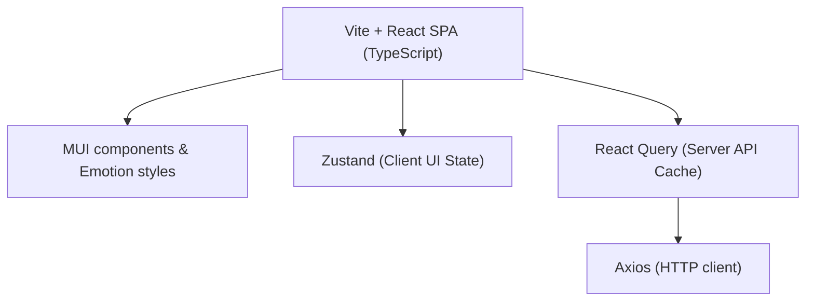

# CareerPilot  Dependency Guide
### `By IUT_shonghorsho`

This document catalogs the core libraries, drivers, and frameworks powering both the backend FastAPI service and the React frontend client, annotated with their precise architectural roles.

---

##  Backend Architecture (Python 3.11 FastAPI)

The backend is built as an async-first, stateless microservice layer. It leverages FastAPI for request handling and offloads heavy database, automation, and AI processing to specialized async drivers.

### Core Framework & Routing

| Dependency | Target Version | Architectural Role & Purpose |
| :--- | :--- | :--- |
| **`fastapi`** | `[^0.111.0]` | High-performance ASGI web framework providing native async endpoints. |
| **`uvicorn`** | `[^0.30.0]` | Lightning-fast ASGI server implementation to execute the FastAPI application. |
| **`pydantic`** | `[^2.4.0]` | Pydantic v2 for robust data parsing, strict coercion, and automatic schema validation. |
| **`python-dotenv`** | `[^1.0.0]` | Automatically injects local environment variables (`.env`) into the system environment. |

### Database, ORM & Vector Store (RAG)

| Dependency | Target Version | Architectural Role & Purpose |
| :--- | :--- | :--- |
| **`sqlalchemy[asyncio]`** | `[^2.0.0]` | SQLAlchemy 2.0 async ORM mapping models cleanly to relational tables. |
| **`alembic`** | `[^1.13.0]` | Manages declarative relational database schema versions and migrations. |
| **`asyncpg`** | `[latest]` | Asynchronous PostgreSQL driver for high-concurrency database queries. |
| **`pgvector`** | `[latest]` | Native Python adapter for PostgreSQL `pgvector` operations. |
| **`langchain-postgres`** | `[latest]` | Vector database connector mapping embedded text chunks to pgvector tables. |

### AI Core, NLP & Machine Learning

| Dependency | Target Version | Architectural Role & Purpose |
| :--- | :--- | :--- |
| **`google-generativeai`**| `[^0.3.0]` | Official SDK to connect with high-efficiency Gemini models (Gemini 1.5 Flash). |
| **`openai`** | `[^1.3.0]` | Standard OpenAI client for fallback queries and LiteLLM gateway compatibility. |
| **`sentence-transformers`**| `[^2.2.0]` | Generates local 384-dimension vector embeddings using `all-MiniLM-L6-v2`. |
| **`spacy`** | `[^3.7.0]` | NLP engine powered by the `en_core_web_sm` model for keyword and ATS analysis. |
| **`fuzzywuzzy`** | `[^0.18.0]` | Rapid fuzzy string matching algorithms to identify partial skill matching scores. |

### Browser Automation & Scraping Engines

| Dependency | Target Version | Architectural Role & Purpose |
| :--- | :--- | :--- |
| **`browser-use`** | `[>=0.1.40,<0.2.0]`| Orchestrates agentic LLM-driven browser navigation and interactive sessions. |
| **`playwright`** | `[^1.40.0]` | High-speed headless Chromium automation driver supporting non-blocking async loops. |
| **`crawl4ai`** | `[^0.5.0]` | High-speed semantic markdown extraction from job postings and directories. |
| **`beautifulsoup4`** | `[^4.12.0]` | Tree-based HTML parsing, lexical traversal, and text extraction. |

### Document Parsing & Compiling

| Dependency | Target Version | Architectural Role & Purpose |
| :--- | :--- | :--- |
| **`python-docx`** | `[^1.0.0]` | Creates and modifies MS Word DOCX structures for publication-grade CV copies. |
| **`docxtpl`** | `[^0.16.7]` | Combines Word templates with Jinja2 contexts for rapid, structured form renders. |
| **`PyPDF2` / `pypdf`** | `[^3.0.0] / [^4.0]` | Parses uploaded PDF documents, extracting raw texts and sections. |
| **`markdown`** | `[^3.4.0]` | Renders raw Markdown content streams into highly-readable HTML payloads. |

> [!IMPORTANT]
> **Production Bottleneck Warning**: Running `sentence-transformers` locally inside Python threads can lead to **CPU starvation** under heavy user load. In production, we strongly recommend offloading this to an external **Hugging Face Text Embeddings Inference (TEI)** cluster as outlined in `SYSTEM_DESIGN.md`.

---

##  Frontend Architecture (React 18 + TS)

The client is a single-page application built on Vite + React. It employs Material UI for a polished, state-of-the-art aesthetic and manages state asynchronously through Zustand and React Query.

### Visual & Interactive Components

| Dependency | Target Version | Architectural Role & Purpose |
| :--- | :--- | :--- |
| **`react`** | `[^18.2.0]` | Core user interface structural rendering engine. |
| **`react-router-dom`** | `[^6.21.0]` | Manages client-side routing, navigation paths, and link parameters. |
| **`@mui/material`** | `[^5.15.0]` | State-of-the-art Material UI components establishing a sleek, premium look. |
| **`recharts`** | `[^2.10.0]` | Fluid, responsive SVG data charts used to visualize application funnels. |
| **`mermaid`** | `[^11.15.0]` | Renders beautiful system architecture charts on-the-fly. |
| **`react-markdown`** | `[^10.1.0]` | Visualizes tailored Markdown resumes and cover letters inside interactive modals. |

### State Management & Communication

| Dependency | Target Version | Architectural Role & Purpose |
| :--- | :--- | :--- |
| **`@tanstack/react-query`**| `[^5.0.0]` | Manages server-side cache synchronization and handles loading shimmer states. |
| **`zustand`** | `[^4.4.0]` | Ultra-lightweight decentralized global client state (sidebar states, theme settings). |
| **`axios`** | `[^1.6.0]` | Promise-based client used to submit async requests to backend routers. |

> [!TIP]
> **State Segregation Best Practice**: By segregating server state (`react-query`) from client state (`zustand`), CareerPilot avoids unnecessary React component re-renders, maintaining sub-15ms client responsiveness during heavy dashboard animations.
