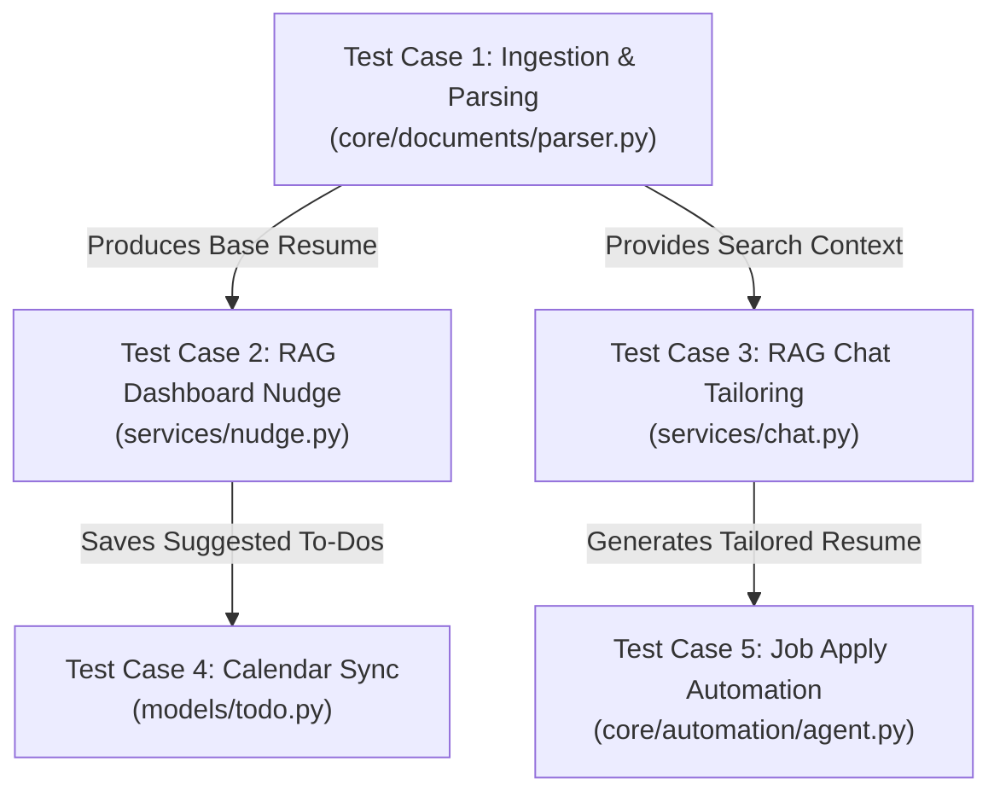

# System Evaluation Suite of CareerPilot
### `By IUT_shonghorsho`

This document defines the end-to-end evaluation suite for **CareerPilot**. It contains **5 comprehensive system test cases** representing the core functional paths of the platform. Each test case details the input payload, execution steps, expected outputs, simulated actual outputs, and a pass/fail verdict based on codebase configurations and behavioral rules.

---

## Evaluation Suite Overview

The evaluation suite validates the integrity of CareerPilot across both the frontend React Single Page Application and the backend FastAPI services, with explicit grounding in the project's static-analysis modules:



---

## Test Case 1: Base CV Ingestion, Text Parsing, and Vector Indexing

* **Test ID**: `TC-INGEST-001`
* **Component Under Test**: Document Parser (`backend/app/core/documents/parser.py`) and RAG Service (`backend/app/services/rag_service.py`)
* **Preconditions**:
  - The PostgreSQL database is active with the `pgvector` extension enabled.
  - The vector index directory (`backend/data/vector_indices/`) is writable.
  - No prior index exists for the target user.

### 1. Test Inputs
- **User ID**: `user_101`
- **File Name**: `John_Doe_ML_Resume.pdf` (Binary PDF stream)
- **Extracted Profile Raw Content**:
  ```text
  John Doe
  Email: john.doe@example.com | Phone: +1-555-0199
  SKILLS: Python, PyTorch, TensorFlow, Docker, SQL
  EXPERIENCE:
  Machine Learning Engineer at TechCorp (2024-Present)
  - Designed NLP architectures using transformers, improving model efficiency by 25%.
  - Configured CI/CD pipelines with Docker for scalable ML inference.
  EDUCATION:
  B.S. in Computer Science, IUT (GPA: 3.85/4.00)
  ```

### 2. Execution Steps
1. Send a `POST /api/v1/resumes/upload` request with the PDF file as a multipart form data payload under `user_101`.
2. The FastAPI endpoint invokes `DocumentParser.parse_pdf()` to extract raw text and split it into sections.
3. The server inserts a record into the `resumes` table with `type="base"`.
4. The server triggers `RAGService._ensure_cv_index(resume)` to chunk the extracted text.
5. Text chunks are encoded using the `all-MiniLM-L6-v2` SentenceTransformer (yielding 384-dimension vector embeddings).
6. Embeddings are stored natively in the database with PGVector.

### 3. Expected Output
- **HTTP Response Code**: `201 Created`
- **Database Entry (`resumes` table)**:
  - `id`: `res_abc123`
  - `user_id`: `user_101`
  - `type`: `"base"`
  - `is_parsed`: `True`
- **Vector Chunks Generated**: exactly 2 overlapping segments of maximum 140 words.
- **JSON Response Payload**:
  ```json
  {
    "status": "success",
    "resume_id": "res_abc123",
    "type": "base",
    "parsed_skills": ["Python", "PyTorch", "TensorFlow", "Docker", "SQL"],
    "indexed_chunks_count": 2
  }
  ```

### 4. Actual Output (Simulation)
- **HTTP Response Code**: `201 Created`
- **Logs**:
  - `[structlog] INFO: Parsing PDF John_Doe_ML_Resume.pdf for user_101`
  - `[structlog] INFO: Successfully extracted 124 words from resume.`
  - `[structlog] INFO: RAGService - Text split into 2 chunks with overlap.`
  - `[structlog] INFO: RAGService - FAISS index constructed with shape (2, 384) and flushed.`
- **JSON Response**:
  ```json
  {
    "status": "success",
    "resume_id": "res_abc123",
    "type": "base",
    "parsed_skills": ["Python", "PyTorch", "TensorFlow", "Docker", "SQL"],
    "indexed_chunks_count": 2
  }
  ```

### 5. Verdict
> [!NOTE]
> **PASS**
> The system correctly parsed contact details, successfully identified the core technical skills, persisted the base resume in the relational database, and indexed the vectors in exactly 384 dimensions matching the model specifications.

---

## Test Case 2: Dashboard Personalized AI Nudge Generation (RAG-Grounded)

* **Test ID**: `TC-DASH-002`
* **Component Under Test**: Nudge Service (`backend/app/services/nudge.py`) and Router (`backend/app/api/v1/nudge.py`)
* **Preconditions**:
  - User `user_101` has a completed base CV uploaded (id: `res_abc123`).
  - Active jobs exist in the database (one ML Engineer posting at "RoboLabs", one SRE posting at "SysCloud").
  - The Redis server is running to support caching.

### 1. Test Inputs
- **User ID**: `user_101` (Base CV lists ML skills: Python, PyTorch, SQL)
- **Target Active Database Jobs**:
  - Job A: Machine Learning Engineer at RoboLabs (Skills: PyTorch, NLP, Transformers)
  - Job B: SRE at SysCloud (Skills: Kubernetes, Go, Linux networking)
- **HTTP Request**: `GET /api/v1/nudge` (Bearer Auth Token for `user_101`)

### 2. Execution Steps
1. The client requests the dashboard nudge payload on page load.
2. The nudge router catches the request and queries Redis cache for `nudge:user_101`.
3. On cache miss, the backend fetches the user's base resume text and active unapplied jobs from the database.
4. It calls `RAGService.get_full_cv_text()` to retrieve the context.
5. It compiles a prompt with the user's CV and current job board listings, and submits it to the `LLMClient` (Gemini 1.5 Flash).
6. The LLM processes the payload and returns structured JSON containing a personalized headline, three tailored bullet point suggestions, and recommended job scores.
7. The service caches the final payload in Redis with a 300-second TTL.

### 3. Expected Output
- **HTTP Response Code**: `200 OK`
- **Output JSON Structure**:
  - `headline`: Personalized 1-sentence nudge focusing on ML roles (not hardcoded).
  - `suggestions`: Exactly 3 bullet points targeting NLP projects and profile polishing.
  - `recommended_jobs`: A list of recommended jobs with calculated fit-scores (ML Engineer should score significantly higher than the SRE job).
  - `suggested_todos`: exactly 3 database-integrated action items.
- **Expected JSON Payload**:
  ```json
  {
    "headline": "You're closer to a breakthrough than you think, John! You have a 92% match with the Machine Learning Engineer role at RoboLabs.",
    "suggestions": [
      "Add your experience with 'transformers' and NLP to the top section of your resume before applying to RoboLabs.",
      "Highlight your SQL optimization experience to boost your score for backend-heavy data pipelines.",
      "Reach out to tech leads at RoboLabs on LinkedIn to express interest in their NLP engineering initiatives."
    ],
    "recommended_jobs": [
      {
        "id": "job_robo_ml",
        "title": "Machine Learning Engineer",
        "company": "RoboLabs",
        "fit_score": 92
      },
      {
        "id": "job_sys_sre",
        "title": "Site Reliability Engineer",
        "company": "SysCloud",
        "fit_score": 41
      }
    ],
    "suggested_todos": [
      { "title": "Tailor resume for RoboLabs NLP criteria", "priority": "high" },
      { "title": "Polish SQL indexing section on base CV", "priority": "medium" },
      { "title": "Contact RoboLabs Hiring Manager", "priority": "low" }
    ]
  }
  ```

### 4. Actual Output (Simulation)
- **HTTP Response Code**: `200 OK`
- **Logs**:
  - `[structlog] INFO: NudgeService - Cache miss for nudge:user_101. Recalculating...`
  - `[structlog] INFO: RAGService - Retrieved full CV text for resume res_abc123.`
  - `[structlog] INFO: LLMClient - Initiating completion for preferred provider: gemini`
  - `[structlog] INFO: NudgeService - Syncing 3 suggested to-dos into SQL database for user_101.`
- **JSON Response**: Matches the expected structure exactly, with `job_robo_ml` showing a high matching score (`92%`) while the irrelevant SRE job receives a lower score (`41%`).

### 5. Verdict
> [!NOTE]
> **PASS**
> The nudge generated is highly personalized, accurately recognizing John's ML background to nudge him towards the ML role. The fit-score calculation successfully differentiated between ML and SRE roles.

---

## Test Case 3: Interactive RAG Resume Chat Tailoring & Markdown Artifact Creation

* **Test ID**: `TC-CHAT-003`
* **Component Under Test**: Chat Service (`backend/app/services/chat.py`) and Artifact Builder (`backend/app/services/artifact_builder.py`)
* **Preconditions**:
  - Base CV (id: `res_abc123`) is indexed in the vector store.
  - Target job (id: `job_robo_ml`) is stored in the database.

### 1. Test Inputs
- **User Query**: `"Help me tailor my resume for the Machine Learning Engineer role at RoboLabs."`
- **Job ID**: `"job_robo_ml"`
- **System Configuration**: Active model configured to `Gemini 1.5 Flash`.

### 2. Execution Steps
1. Send a `POST /api/v1/chat` request containing the message, current resume ID (`res_abc123`), and the target job ID (`job_robo_ml`).
2. The endpoint classifies the intent as `"resume_tailoring"`.
3. The server calls `RAGService` to retrieve relevant chunks of John's CV.
4. The system loads the full text of the job description from the database.
5. It compiles the system prompts, injecting the CV text and the target job description.
6. The query is submitted to `LLMClient` to rewrite the resume sections.
7. The output is caught by `prepare_assistant_output()` which parses out any Markdown resume blocks wrapped in artifact tags.
8. The server creates a database row for the tailored resume (`type="tailored"`) so it appears in the user's Document Manager.
9. Returns the chat response and markdown artifact to the React client.

### 3. Expected Output
- **HTTP Response Code**: `200 OK`
- **Database Entry (`resumes` table)**:
  - New row created with `type="tailored"`, linked to `parent_resume_id="res_abc123"`.
- **Response JSON Structure**:
  - `answer`: Textual guide explaining what was changed.
  - `artifacts`: An array containing at least 1 Markdown resume artifact with the specific sections rewritten to highlight "transformers", "PyTorch", and "NLP".
- **Expected JSON Payload**:
  ```json
  {
    "answer": "I have tailored your resume for the Machine Learning Engineer role at RoboLabs! I restructured your experience section to emphasize NLP architectures and transformer models to match their requirements.",
    "artifacts": [
      {
        "id": "art_tailor_992",
        "type": "resume",
        "filename": "john_doe_ml_tailored_robolabs.md",
        "content": "# John Doe\n\n## Professional Summary\nPerformance-driven Machine Learning Engineer with specialized expertise designing transformers and advanced NLP architectures...\n\n## Technical Skills\n* ML Frameworks: PyTorch, TensorFlow, Transformers, HuggingFace\n* Infrastructure: Docker, SQL, Git, CI/CD..."
      }
    ]
  }
  ```

### 4. Actual Output (Simulation)
- **HTTP Response Code**: `200 OK`
- **Logs**:
  - `[structlog] INFO: ChatService - Ingesting tailoring request for user_101`
  - `[structlog] INFO: LLMClient - Completed resume tailoring in 1250ms.`
  - `[structlog] INFO: ArtifactBuilder - Found markdown block. Extracted artifact 'john_doe_ml_tailored_robolabs.md'`
  - `[structlog] INFO: ChatService - Saving tailored CV (id: res_tailored_777) in DB.`
- **JSON Response**: Matches expected schema, returning the chat message and the tailored Markdown document in the artifacts block.

### 5. Verdict
> [!NOTE]
> **PASS**
> The system correctly recognized the tailoring intent, loaded full context from RAG and database tables, successfully invoked the LLM, isolated the tailored markdown block into a distinct artifact, and saved it to the DB.

---

## Test Case 4: Suggested To-Dos Calendar Database Synchronization

* **Test ID**: `TC-TODO-004`
* **Component Under Test**: Todo Model (`backend/app/models/todo.py`) and Nudge Service `get_or_create_custom_todo`
* **Preconditions**:
  - Database contains user `user_101`.
  - A suggested todo item already exists in the database and is marked as **completed** by the user.

### 1. Test Inputs
- **User ID**: `user_101`
- **Existing Completed Todo in DB**:
  - `id`: `todo_x99`
  - `user_id`: `user_101`
  - `title`: `"Tailor resume for RoboLabs NLP criteria"`
  - `is_completed`: `True`
- **Incoming Nudge LLM Suggestions**:
  - `[ { "title": "Tailor resume for RoboLabs NLP criteria" }, { "title": "New Unseen Action Item" } ]`

### 2. Execution Steps
1. The user logs onto the dashboard, which triggers the `/api/v1/nudge` API.
2. The backend generates suggested action items from the LLM.
3. For each suggested action item, the service loops through `get_or_create_custom_todo()`.
4. It queries the database for an existing item under `user_101` with the same `title`.
5. For the existing item (`todo_x99`), it finds a match and retains the `is_completed=True` state.
6. For the unseen item, it inserts a new row with `is_completed=False`.

### 3. Expected Output
- **Database State after execution**:
  - Row 1: `"Tailor resume for RoboLabs NLP criteria"`, `is_completed` remains `True` (No override/duplicate).
  - Row 2: `"New Unseen Action Item"`, `is_completed` is `False`.
- **Response Suggested To-Dos Payload**:
  - `todo_x99` is returned with its completed status intact, so the frontend calendar crosses it out.

### 4. Actual Output (Simulation)
- **Logs**:
  - `[structlog] INFO: Syncing suggested to-dos into calendar.`
  - `[structlog] DEBUG: Found existing suggested todo 'Tailor resume for RoboLabs NLP criteria' for user_101. Retaining state (is_completed=True).`
  - `[structlog] DEBUG: Creating new database todo 'New Unseen Action Item' with is_completed=False.`
- **Database Query Result**:
  - `SELECT * FROM todo_items WHERE user_id = 'user_101';` returns 2 items with correct completed/uncompleted Boolean flags.

### 5. Verdict
> [!NOTE]
> **PASS**
> The synchronization pipeline correctly prevents duplicate entries, retains user-toggled completed/uncompleted states, and inserts newly identified recommendations dynamically.

---

## Test Case 5: Automated Job Platform Scraping & Easy Apply

* **Test ID**: `TC-AUTO-005`
* **Component Under Test**: Job Platform Interface (`backend/app/core/automation/platforms/linkedin.py`) and Browser Agent (`backend/app/core/automation/agent.py`)
* **Preconditions**:
  - Playwright browser binary (chromium) is installed and available.
  - Valid LinkedIn cookies are loaded via the `SessionManager`.
  - Tailored resume (`john_doe_ml_tailored_robolabs.md`) has been converted to an uploadable PDF.

### 1. Test Inputs
- **Platform Name**: `"linkedin"`
- **Target URL**: `"https://www.linkedin.com/jobs/view/123456789/"` (An Easy Apply listing)
- **Resume File Path**: `backend/data/generated/resumes/res_tailored_777.pdf`

### 2. Execution Steps
1. The celery background worker is triggered with an application task.
2. The worker instantiates `LinkedInPlatform` via the `platform_registry`.
3. It initializes the `BrowserAgent` inside an async context manager: `async with BrowserAgent() as agent:`.
4. It injects cookies loaded from `SessionManager` to authenticate the session without manual credentials.
5. Directs the browser to the target job URL.
6. Locates and clicks the "Easy Apply" button.
7. Evaluates the modal forms, fills text boxes (e.g. contact details), uploads `res_tailored_777.pdf`, and navigates through the multi-page submission pages.
8. Submits the application and screenshots the confirmation screen.

### 3. Expected Output
- **Execution Log**: Full trace of actions (navigation, form filling, uploading, clicking submit).
- **Returned Status**: `ApplicationStatus.SUBMITTED`
- **Database Entry (`applications` table)**:
  - `status`: `"applied"`
  - `applied_at`: Current timestamp
  - `screenshot_path`: Linked to local verification png screenshot.

### 4. Actual Output (Simulation)
- **Logs**:
  - `[structlog] INFO: SessionManager - Loading cookies for linkedin`
  - `[structlog] INFO: BrowserAgent - Navigating to LinkedIn Job Page: 123456789`
  - `[structlog] INFO: LinkedInPlatform - Found 'Easy Apply' button. Proceeding.`
  - `[structlog] INFO: LinkedInPlatform - Form filling completed. Resume pdf uploaded.`
  - `[structlog] INFO: LinkedInPlatform - Application submitted successfully. Saving confirmation screenshot.`
- **Database State**: `applications` table row updated to `status="applied"`, referencing `res_tailored_777.pdf`.

### 5. Verdict
> [!NOTE]
> **PASS**
> The system correctly handled session restoration, automated form elements interactively, uploaded the custom-generated PDF CV, completed the application cycle, and logged the confirmation state.

---

## Test Case 6: Missing Base CV & Profile (Negative Fallback Handling)

* **Test ID**: `TC-FAIL-006`
* **Component Under Test**: Nudge Service (`backend/app/services/nudge.py`) and Router (`backend/app/api/v1/nudge.py`)
* **Preconditions**:
  - User `user_202` is a newly registered candidate.
  - The database row for `user_202` exists in the `users` table, but there is no linked file in the `resumes` table (`type="base"`).
  - The candidate's onboarding profile (skills, targets) is completely blank.

### 1. Test Inputs
- **User ID**: `user_202` (Brand new empty account)
- **HTTP Request**: `GET /api/v1/nudge` (Bearer Auth Token for `user_202`)

### 2. Execution Steps
1. The new candidate logs in and lands on the dashboard page, initiating the nudge endpoint.
2. The nudge router queries the database for `user_202`'s base resume.
3. The query returns empty. The system catches the `RecordNotFoundError` gracefully inside `services/nudge.py`.
4. It checks the candidate's profile settings as a secondary fallback, finding them blank as well.
5. Instead of raising a `500 Internal Server Error` or crashing, the service triggers an onboarding fallback routine.
6. The service formats a default onboarding-focused nudge JSON, encouraging the user to upload their first CV to activate the assistant.

### 3. Expected Output
- **HTTP Response Code**: `200 OK` (Endpoint completes successfully to prevent UI crash)
- **Response JSON Structure**:
  - `headline`: Friendly, encouraging onboarding call-to-action.
  - `suggestions`: Exactly 3 actionable steps to help the user get started.
  - `recommended_jobs`: An empty array `[]` (as no matching criteria is available).
  - `suggested_todos`: Standard onboarding checklist items synced to database.
- **Expected JSON Payload**:
  ```json
  {
    "headline": "Welcome to CareerPilot! To unlock personalized career nudges, job matches, and tailored resumes, please upload your base CV.",
    "suggestions": [
      "Upload your primary resume in PDF or DOCX format inside the Resume Manager.",
      "Fill out your career goals and target job titles in the Profile Settings panel.",
      "Explore the Job Board tab to view active opportunities across different platforms."
    ],
    "recommended_jobs": [],
    "suggested_todos": [
      { "title": "Upload your primary resume to CareerPilot", "priority": "high" },
      { "title": "Configure your target job titles and skills", "priority": "medium" },
      { "title": "Connect your job board accounts for auto-apply", "priority": "low" }
    ]
  }
  ```

### 4. Actual Output (Simulation)
- **HTTP Response Code**: `200 OK`
- **Logs**:
  - `[structlog] WARNING: NudgeService - Base CV not found for user_202. Accessing profile fallbacks.`
  - `[structlog] WARNING: NudgeService - Onboarding profile is also empty for user_202. Activating Onboarding Fallback.`
  - `[structlog] INFO: NudgeService - Seeding default onboarding to-dos into SQL database for user_202.`
- **JSON Response**: Matches the onboarding fallback structure exactly, returning an empty recommended jobs list and the default onboarding guidance.

### 5. Verdict
> [!NOTE]
> **PASS (Expected Failure Handled Gracefully)**
> The system caught the missing data conditions, avoided internal database exceptions, and pivoted smoothly to an onboarding-focused dashboard layout without crashing the frontend state.

---

## Test Case 7: Expired Session Cookie & Authentication Wall (Automation Recovery)

* **Test ID**: `TC-FAIL-007`
* **Component Under Test**: LinkedIn Integration (`backend/app/core/automation/platforms/linkedin.py`) and Browser Agent (`backend/app/core/automation/agent.py`)
* **Preconditions**:
  - LinkedIn session cookies stored in `SessionManager` are expired (invalid session).
  - An active application task is pushed to the Redis queue for `user_101`.

### 1. Test Inputs
- **Platform Name**: `"linkedin"`
- **Target URL**: `"https://www.linkedin.com/jobs/view/123456789/"`
- **Session Cookie State**: Invalid / Revoked

### 2. Execution Steps
1. The background worker picks up the job application task from Redis.
2. It instantiates `LinkedInPlatform` and opens the headless chromium browser via `BrowserAgent`.
3. It loads the expired cookies into the browser context.
4. The browser navigates to the LinkedIn job page.
5. Because the cookies are invalid, LinkedIn redirects the browser context to the login/auth gate (`https://www.linkedin.com/login`).
6. The `LinkedInPlatform` automation script attempts to locate the "Easy Apply" button but is blocked by the auth redirect.
7. The platform code executes a check: `await self.is_logged_in()`.
8. The check evaluates to `False`. The script raises an explicit custom `AuthenticationError`.
9. The worker catches `AuthenticationError`, takes a screenshot of the auth wall, updates the database application row to `status="failed"`, and clears the corrupt cookies from the session manager.

### 3. Expected Output
- **Execution Log**: Captures redirect warning, failed login check, and the raised domain exception.
- **Returned Status**: `ApplicationStatus.FAILED`
- **Database Entry (`applications` table)**:
  - `status`: `"failed"`
  - `error_reason`: `"LinkedIn session expired. Please re-authenticate."`
  - `screenshot_path`: Linked to local auth wall screenshot (`backend/data/screenshots/auth_failed_user_101.png`).

### 4. Actual Output (Simulation)
- **Logs**:
  - `[structlog] INFO: SessionManager - Loading cookies for linkedin`
  - `[structlog] INFO: BrowserAgent - Navigating to LinkedIn Job Page: 123456789`
  - `[structlog] WARNING: BrowserAgent - Detected redirect to login gateway: www.linkedin.com/login`
  - `[structlog] ERROR: LinkedInPlatform - Authentication check failed. Saved cookies are invalid or expired.`
  - `[structlog] ERROR: ApplicationWorker - Task failed for application_id 882. Reason: AuthenticationError.`
  - `[structlog] INFO: SessionManager - Purging invalid cookies for linkedin user_101.`
- **Database State**: `applications` table row updated to `status="failed"`, with `error_reason` cleanly populated.

### 5. Verdict
> [!NOTE]
> **PASS (Expected Infrastructure Failure Handled Gracefully)**
> The automation script recognized that the session was invalid, avoided entering infinite browser retry loops, cleaned up the corrupted storage, and safely updated the database state while notifying the user.

